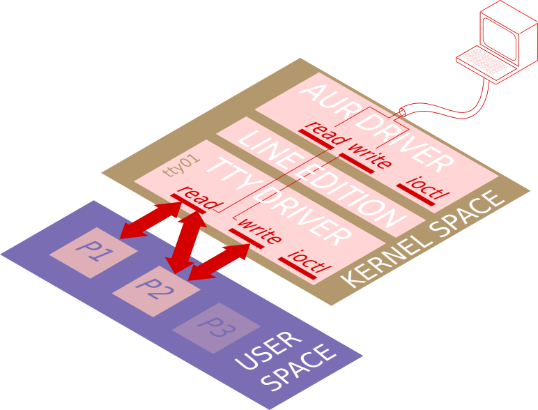
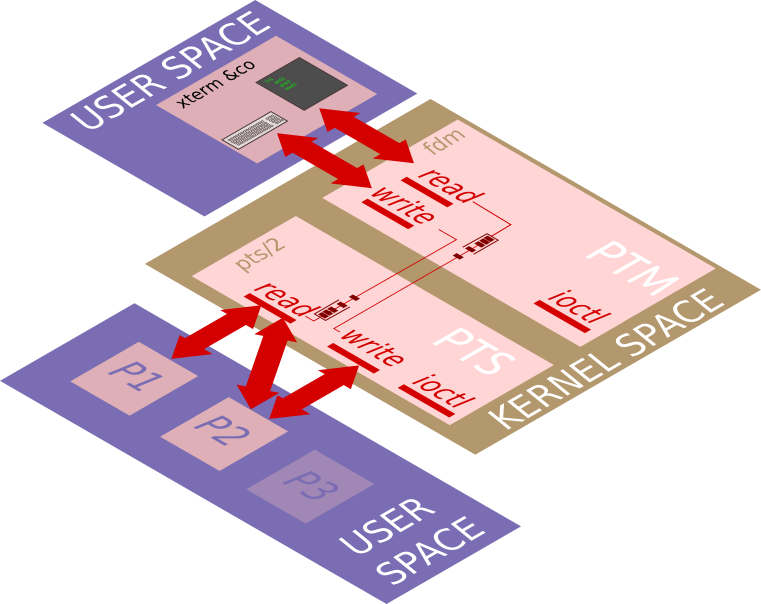

# Работа терминала в Linux  
## Основные термины
**Terminal (терминал)** — это комбинация дисплея и клавиатуры, то есть физическое устройство.
До терминала существовал **teleprinter (teletype, teletypewriter или TTY сокращенно)**, то есть комбинация принтера и клавиатуры. 
  
**Console (консоль)** — терминал, который подключен напрямую к компьютеру.
Т.к. большинство терминалов было подключено к компьютеру неявно, но хотя бы один подключался напрямую, позволяя настраивать компьютер (доступ к нему был у ограниченного круга лиц).   

**Shell (command line interpreter)** - программное обеспечение, главной задачей которого является запуск других программ и обработка команд.  
Проще говоря, это ПО, которое принимает какой-то ввод (от пользователя или программы), обрабатывает его (парсит)
и что-то делает (запускает другие программы, управляет процессами и др.).  
Примеры: bash, dash, zsh и т.п.  

**Terminal emulator (эмулятор терминала)** - программное обеспечение, отвечающее за ввод и вывод информации.
Эмулятор - это GUI приложение, которое открывается в отдельном окне и запускает внутри себя Shell.
Используемый в системе эмулятор можно узнать, выполнив команду *echo $TERM*  
Примеры: gnome-terminal, xterm, konsole.  
*Далее в статье все упоминания терминала будут относиться к эмулятору терминала или виртуальной консоли*
  
**Virtual Console/Virtual Terminal (виртуальная консоль/терминал)** - функция, позволяющая переключаться между несколькими
независимыми сеансами с помощью сочетания клавиш ctrl + alt + FN (обычно от 1 до 6), которые именуются tty(1-6).  
>**Важно понимать:** каждый виртуальный терминал - это *отдельный* сеанс в системе. Т.е. в рамках каждого такого терминала
пользователь отдельно логиниться и пользуется системой. Если в ОС установлен графический интерфейс, зачастую он
предоставляется лишь на одной виртуальной консоли, во всех остальных же будет запущен только Shell. Т.е. эмулятор
терминала может лишь создать новые окна в том же сеансе, но не создать новые сеансы.
  
**TTY устройство (терминальное устройство)** - виртуальное устройство, которое назначается каждому терминалу (т.е. каждой сессии(окну) эмулятора терминала (PTY device) или каждой виртуальной консоли (Console device)).  
TTY устройство состоит из двух частей:  
1. **Драйвер устройства**. Он отвечает за доставку ввода с клавиатуры в программу и за отображение вывода программы на экран.
2. **TTY Line Discipline (дисциплина линии)** - интерфейс доступа к драйверу. Является промежуточным звеном между вводом/выводом и непосредственном драйвером.
   
TTY устройства делятся на 3 типа:
1. *Console device* обеспечивает работу виртуальной консоли. Ввод и вывод данного устройства управляется полностью ядром.
2. *PTY device (псевдотерминал)* обеспечивает работу сессии в эмуляторе терминала. Ввод и вывод данного устройства управляется эмулятором.
3. *Serial device* общается напрямую с железом. Обычно не используется напрямую, а существует как самый нижний уровень в организации архитектуры терминального устройства.  

Тут стоит остановиться и рассмотреть подробнее работу TTY устройства.
## TTY Line Discipline
Первой важной особенностью дисциплины линии является *процессинг ввода и вывода*. За это отвечает компонент **TTY Line Editing**.
>Стоит оговориться, что **Line Editing** - общее понятие, которое относится к процессингу ввода. Например, Bash и Vim имеют свой Line Editing. Зачем это нужно? К примеру, Vim сам осуществляет процессинг ввода, в то время как для дисциплины линии включается режим raw, таким образом спец. символы Vim и Bash не пересекаются.
  
Процессинг ввода и вывода включает в себя обработку управляющих символов и форматирование вывода. Разберем подробно, как это происходит.  
По умолчанию TTY устройство работает в каноничном режиме с включенным эхо (echoing), т.е. отображением вводимых символов на экране. Когда мы вводим, к примеру, символ a, данный символ посылается в TTY устройство, но перехватывается дисциплиной линии TTY устройства. Она читает символ в свой внутренний буфер, видит, что включен режим echo и выводит символ на экран. Пусть мы нажимаем backspace на клавиатуре. Символ ^? снова перехватывается дисциплиной линии, и последняя, понимая, что пользователь хочет стереть последний введенный символ, удаляет данный символ из своего внутреннего буфера и стирает этот символ также с экрана. Теперь, если мы нажмем Enter, TTY Line Discipline наконец пошлет в буфер чтения терминального устройства все, что было записано раннее во внутренний буфер дисциплины, включая LF (символ конца строки). При этом, на экран выводятся символы CR и LF для того, чтобы перевести курсор на новую строку — это форматирование вывода.
## Terminal Emulator и Pseudoterminal
Каждый раз, при запуске нового окна в эмуляторе терминала порождается новый процесс с запущенной по умолчанию программой, обычно это какой-то Shell (например, Bash).  
Общение с запущенной программой происходит через так называемый **Pseudoterminal (псевдотерминал, PTY)**.  
Псевдотерминал состоит из следующих двух виртуальных TTY устройств:
1) **PTY master (PTM)** — ведущая часть псевдотерминала. Является *файловым дескриптором*.
2) **PTY slave (PTS)** — ведомая часть псевдотерминала. 
>**Важно!** PTM и PTS все еще являются TTY устройствами, это означает, что оба устройства имеют свой TTY Line Discipline, которая обслуживает функции *read()* и *write()*, позволяя им общаться. Дисциплина линии PTM устройства установлена в raw режим, поэтому процессинг проводиться лишь на PTS устройстве.

+ PTM работает с эмулятором терминала, считывая ввод и выводя вывод на экран.
+ PTS работает с конкретным процессом (приложением), для которого оно было запущено, например *Bash*.
+ Для самого процесса PTS выглядит как обычное TTY-устройство, будто никакого псевдотерминала и нет.
+ В то же время PTM и PTS постоянно обмениваются информацией друг с другом: все, что приходит в PTM, появляется и в PTS, и наоборот, все, что приходит в PTS, отправляется в PTM.

Нашел пару схем, наглядно объясняющих разницу в работе TTY и PTY:
 
 

## Полезные ссылки
1. [https://habr.com/ru/articles/460257/](https://habr.com/ru/articles/460257/) - Основная статья с полным описанием работы терминала на русском и объяснения как работает функция printf "в железе"
2. [https://dzen.ru/a/YGM9M_VxZTl-lnxc](https://dzen.ru/a/YGM9M_VxZTl-lnxc) - Нарисованная кем-то схема работы всей системы PTY, по статье выше
3. [https://dmilvdv.narod.ru/Translate/LDD3/ldd_small_tty_driver.html](https://dmilvdv.narod.ru/Translate/LDD3/ldd_small_tty_driver.html) - Самописный TTY-драйвер
4. [https://unix.stackexchange.com/questions/117981/what-are-the-responsibilities-of-each-pseudo-terminal-pty-component-software](https://unix.stackexchange.com/questions/117981/what-are-the-responsibilities-of-each-pseudo-terminal-pty-component-software) - Обсуждение на англоязычном форуме работы PTY. Содержит полезное описание и картинки
